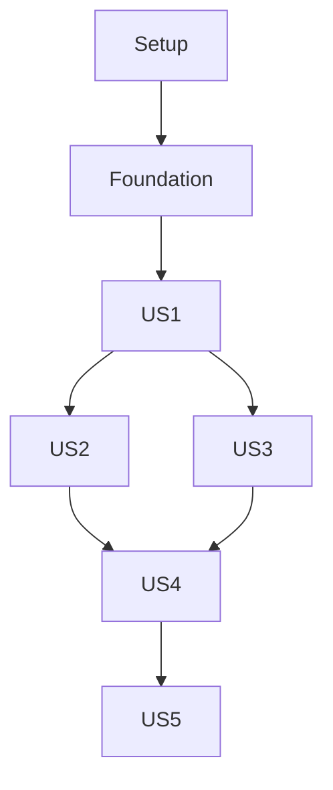

# Tasks: Chapter Reorder with Animations

## Architecture & Tech Stack

- **Frontend**: Next.js 16 (App Router), React 19, TypeScript
- **DnD**: `@dnd-kit/core` + `@dnd-kit/sortable` + `@dnd-kit/utilities`
- **Animations**: CSS transforms (built into @dnd-kit) + Tailwind transitions
- **Toasts**: `sonner` (already configured)
- **State**: React `useOptimistic` for optimistic UI, `useState` for local state
- **API**: `PUT /api/v1/courses/{courseId}/chapters/reorder`

## Dependencies

## Phases

### Phase 1: Setup

**Goal**: Install dependencies and prepare the development environment.

- [X] T001 Install @dnd-kit packages: `npm install @dnd-kit/core @dnd-kit/sortable @dnd-kit/utilities`

---

### Phase 2: Foundational

**Goal**: All prerequisites that block every user story — schema, server action, mock handler.

- [X] T002 [P] Add `reorderItemSchema` and `ReorderItem` type to `src/features/course-management/chapters-schema.ts` (mirroring the existing one in `lessons-schema.ts`, then update `lessons-schema.ts` to re-export from chapters-schema)
- [X] T003 [P] Add `reorderChapters` server action in `src/features/course-management/chapters-actions.ts` following the `ActionResult<ChapterOut[]>` pattern, calling `PUT /api/v1/courses/{courseId}/chapters/reorder`
- [X] T004 [P] Add MSW handler for `PUT /api/v1/courses/{courseId}/chapters/reorder` in `src/features/course-management/__tests__/mocks.ts` (happy path + 409 conflict)

**Independent test**: Run `npm test` — foundational code compiles and mocks work.

---

### Phase 3: [US1] Drag-and-Drop Reorder with Animations

**Goal**: Teachers can reorder chapters by dragging them to new positions with smooth animations and auto-save.

**Scenarios covered**: S1 (drag-and-drop), S3 (Escape cancel), S4 (network failure — basic)

**Test criteria**: Drag a chapter to a new position → chapters animate to new order → order persists on refresh.

- [X] T005 [US1] Wrap `ChapterList` with `DndContext`, `SortableContext`, and `DragOverlay` from @dnd-kit; replace flat chapter map with `useSortable`-enabled items in `src/features/course-management/components/chapter-list.tsx`
- [X] T006 [P] [US1] Add drag handle button (`GripVertical` icon from lucide-react) to `ChapterCard` in `src/features/course-management/components/chapter-card.tsx`
- [X] T007 [P] [US1] Implement `onDragEnd` handler in `ChapterList` that calls `reorderChapters` server action and updates local state optimistically in `src/features/course-management/components/chapter-list.tsx`
- [X] T008 [P] [US1] Implement `onDragCancel` handler returning chapters to original positions with animation in `src/features/course-management/components/chapter-list.tsx`
- [X] T009 [US1] Add `DragOverlay` with a clone of the dragged chapter card for the floating ghost element in `src/features/course-management/components/chapter-list.tsx`
- [X] T010 [P] [US1] Apply Tailwind `transition-all duration-300 ease-out` to chapter card container for smooth shift animations in `src/features/course-management/components/chapter-list.tsx`
- [X] T011 [US1] Show success toast via `toast.success("Chapters reordered")` after successful reorder save in `src/features/course-management/components/chapter-list.tsx`
- [X] T012 [US1] Show error toast via `toast.error("Reorder failed")` on failed reorder save in `src/features/course-management/components/chapter-list.tsx`
- [X] T013 [P] [US1] Update i18n messages in `src/i18n/messages/ar.json` and `src/i18n/messages/en.json` with reorder-related keys (reorder_success, reorder_error, reorder_conflict, drag_handle_label, etc.) under the `chapters` namespace

**Independent test**: Open course with 2+ chapters → drag chapter to new position → see animation → see success toast → refresh page → order persisted.

---

### Phase 4: [US2] Move Up / Move Down Buttons

**Goal**: Teachers can reorder chapters via Move Up/Move Down buttons as an alternative to drag-and-drop.

**Scenarios covered**: S2 (move buttons)

**Test criteria**: Click "Move Down" on first chapter → chapter swaps with second → animation plays → order persists.

- [X] T014 [US2] Add `ReorderButtons` sub-component with ArrowUp/ArrowDown icons (from lucide-react) in a new file `src/features/course-management/components/reorder-buttons.tsx`
- [X] T015 [US2] Integrate `ReorderButtons` into `ChapterCard` header (next to edit/delete buttons) in `src/features/course-management/components/chapter-card.tsx`
- [X] T016 [US2] Wire `onMoveUp`/`onMoveDown` callbacks from `ChapterList` to `ChapterCard` that compute the new order and call `reorderChapters` in `src/features/course-management/components/chapter-list.tsx`
- [X] T017 [US2] Disable "Move Up" on the first chapter and "Move Down" on the last chapter (visually dimmed + disabled) in `src/features/course-management/components/reorder-buttons.tsx`

**Independent test**: Open course with 2+ chapters → click Move Down on first → chapters swap with animation → success toast → refresh confirms persistence.

---

### Phase 5: [US3] Optimistic UI with Rollback & Conflict Handling

**Goal**: UI updates instantly on reorder; if the save fails, it reverts with an animation and shows a retry option. Concurrent edits show a conflict message.

**Scenarios covered**: S4 (network failure), FR-05 (optimistic + rollback), FR-06 (conflict)

**Test criteria**: Disconnect API → reorder → UI updates instantly → error toast + chapters revert on save failure.

- [X] T018 [US3] Implement `useOptimistic` hook in `ChapterList` for immediate UI update on drop in `src/features/course-management/components/chapter-list.tsx`
- [X] T019 [US3] On `reorderChapters` failure: revert chapters to previous order with `transition-all duration-300` animation in `src/features/course-management/components/chapter-list.tsx`
- [X] T020 [US3] Show retry button/action on save failure (re-call `reorderChapters` with the optimistic order) in `src/features/course-management/components/chapter-list.tsx`
- [X] T021 [US3] Handle 409 Conflict response: show `t("error_conflict")` message with a "Refresh" link in `src/features/course-management/chapters-actions.ts` + `src/features/course-management/components/chapter-list.tsx`

**Independent test**: Disconnect API → reorder → see instant UI update → toast error → chapters animate back → click retry with API reconnected → success.

---

### Phase 6: [US4] Single Chapter Edge Case

**Goal**: When a course has only one chapter, drag handles and move buttons are hidden.

**Scenarios covered**: S5 (single chapter)

**Test criteria**: Course with 1 chapter → no drag handle, no move buttons shown.

- [X] T022 [US4] Conditionally render drag handle and move buttons only when `chapters.length > 1` in `src/features/course-management/components/chapter-card.tsx`
- [X] T023 [US4] Show tooltip "Add more chapters to reorder" when hovering over the area where controls would be (single-chapter state) in `src/features/course-management/components/chapter-card.tsx`

**Independent test**: Navigate to course with 1 chapter → verify no drag handle or move buttons → verify tooltip appears.

---

### Phase 7: [US5] Keyboard Accessibility & Screen Reader Support

**Goal**: All reorder actions work via keyboard alone, and screen readers announce reorder state changes.

**Scenarios covered**: FR-07 (keyboard), FR-08 (screen reader)

**Test criteria**: Tab to drag handle → Enter to pick up → Arrow keys to move → Enter to drop → screen reader announces each step.

- [X] T024 [US5] Configure `KeyboardSensor` from `@dnd-kit/sortable` and wire `keyboardCoordinates` for Arrow Up/Down navigation in `src/features/course-management/components/chapter-list.tsx`
- [X] T025 [US5] Add `aria-label` and `aria-roledescription` attributes to drag handles ("Press space to pick up, use arrow keys to move, press space again to drop") in `src/features/course-management/components/chapter-card.tsx`
- [X] T026 [P] [US5] Add `aria-live="polite"` region to `ChapterList` that announces reorder state ("Chapter [title] picked up", "Moved to position [N]", "Chapter [title] dropped at position [N]", "Reorder cancelled", "Reorder failed") in `src/features/course-management/components/chapter-list.tsx`
- [X] T027 [US5] Ensure Move Up/Down buttons have proper `aria-label` ("Move [title] up", "Move [title] down") and respond to Enter/Space keys in `src/features/course-management/components/reorder-buttons.tsx`

**Independent test**: Tab to chapter → press Enter → Arrow Down → Enter → screen reader announces all steps.

---

### Phase 8: Polish & Cross-Cutting

**Goal**: Final cleanup, tests, and edge case hardening.

- [X] T028 Add order number display to `ChapterCard` header (e.g., "1." prefix) in `src/features/course-management/components/chapter-card.tsx`
- [X] T029 Update `src/features/course-management/__tests__/mocks.ts` error handlers to include a 409 handler for chapters reorder
- [X] T030 [P] Add MSW handler for GET chapters (empty array, single item) to support edge case testing in mocks
- [X] T031 Verify all i18n keys for reorder are present in both `ar.json` and `en.json` — run i18n parity test

---

## Implementation Strategy

### MVP (Phase 1 + 2 + 3)

The minimum viable feature is Phase 1 (deps) + Phase 2 (schema + action) + Phase 3 (drag-and-drop with auto-save). This alone delivers drag-and-drop reorder with animations, toasts, and basic error handling.

### Incremental Delivery

| Drop | Phases | Value |
|------|--------|-------|
| MVP | 1, 2, 3 | Core drag-and-drop reorder works |
| Drop 2 | 4, 5 | Move buttons + optimistic rollback |
| Drop 3 | 6, 7, 8 | Edge cases + accessibility + polish |

### Parallel Execution Opportunities

- **Phase 2**: T002 (schema), T003 (action), T004 (mocks) — all independent
- **Phase 3**: T006 (drag handle), T013 (i18n) — independent of T005/T007/T008
- **Phase 5**: T020 (retry), T021 (conflict handling) — independent within phase
- **Phase 7**: T025 (aria labels on card), T026 (live region on list), T027 (aria on buttons) — independent
- **Final**: T029, T030 (mocks) — independent of each other

## Summary

| Phase | Tasks | Story | Parallel |
|-------|-------|-------|----------|
| Phase 1: Setup | 1 | — | No |
| Phase 2: Foundational | 3 | — | 3 tasks |
| Phase 3: Drag-and-Drop | 9 | US1 | 3 tasks |
| Phase 4: Move Buttons | 4 | US2 | 0 |
| Phase 5: Optimistic + Rollback | 4 | US3 | 2 tasks |
| Phase 6: Single Chapter | 2 | US4 | 0 |
| Phase 7: Keyboard + Screen Reader | 4 | US5 | 3 tasks |
| Phase 8: Polish | 4 | — | 2 tasks |

**Total**: 31 tasks
**MVP scope**: Phases 1-3 (13 tasks) — drag-and-drop reorder with animations and auto-save
