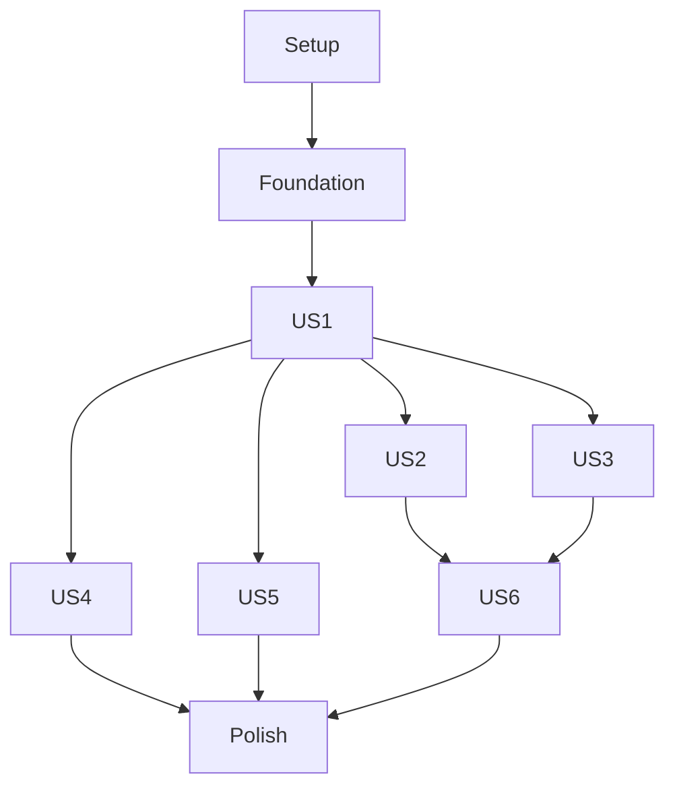

# Tasks: Lesson Items CRUD

## Architecture & Tech Stack

- **Frontend**: Next.js 16 (App Router), React 19, TypeScript
- **DnD**: `@dnd-kit` (already installed for chapters/lessons)
- **State**: React `useState` + `useCallback` (same pattern as chapters/lessons)
- **API**: 8 item endpoints on backend (listed in contracts/)
- **Uploads**: Native `fetch()` via `src/lib/api/upload.ts`
- **Toasts**: `sonner` (already configured)

## Dependencies

## Phases

### Phase 1: Setup

**Goal**: No setup needed — all required packages (`@dnd-kit`, `sonner`, `lucide-react`) are already installed.

- [X] T001 No new packages required — skip

---

### Phase 2: Foundational

**Goal**: All blocking prerequisites — endpoints, schemas, queries, actions, upload helper, mocks, i18n.

- [X] T002 [P] Add items endpoints to `src/lib/api/endpoints.ts` (list, detail, reorder, uploadVideo, requestUploadUrl, confirmUpload)
- [X] T003 [P] Create item Zod schemas (`ItemOut`, `ItemCreate`, `ItemUpdate`) in `src/features/course-management/items-schema.ts`
- [X] T004 [P] Create `listItems` server query in `src/features/course-management/items-queries.ts`
- [X] T005 Create item server actions (`createItem`, `updateItem`, `deleteItem`, `reorderItems`) following `ActionResult<T>` pattern in `src/features/course-management/items-actions.ts`
- [X] T006 Create file upload helper (`uploadFile`, `uploadToPresignedUrl`) in `src/lib/api/upload.ts`
- [X] T007 [P] Add item i18n keys under `items` namespace in `src/i18n/messages/ar.json` and `src/i18n/messages/en.json`
- [X] T008 [P] Add mock items data and MSW handlers (GET items, POST create, PATCH update, DELETE delete, PUT reorder, upload error) in `src/features/course-management/__tests__/mocks.ts`

**Independent test**: Run `npm test` — foundational code compiles and mocks work.

---

### Phase 3: [US1] Item List Display & Create

**Goal**: Teachers can view items inside an expanded lesson and create new items.

**Scenarios covered**: S1 (view items), S2 (create item)

**Test criteria**: Expand a lesson → see item list → click "Add Item" → enter title → item appears.

- [X] T009 [US1] Create `ItemCard` component showing order number, title, type badge (derived from bunny_stream_id/document_path/exam_id), edit/delete buttons in `src/features/course-management/components/item-card.tsx`
- [X] T010 [US1] Create `ItemList` component with create dialog (title input + submit) in `src/features/course-management/components/item-list.tsx`
- [X] T011 [US1] Integrate `ItemList` into `LessonCard` with expand/collapse toggle (same pattern as chapter→lesson) in `src/features/course-management/components/lesson-card.tsx`
- [X] T012 [P] [US1] Fetch items server-side in course detail page and pass as `initialItems` to each `LessonCard` in `app/[locale]/(teacher)/courses/[courseId]/page.tsx`

**Independent test**: Open course with lessons → expand a lesson → see empty item list → create an item → item card appears with order number and title.

---

### Phase 4: [US2] Item Reorder

**Goal**: Teachers can reorder items via drag-and-drop with animations and move up/down buttons.

**Scenarios covered**: S3 (reorder)

**Test criteria**: Create 3 items → drag item 3 to position 1 → smooth animation → order persists on refresh.

- [X] T013 [US2] Add `SortableItemCard` wrapper with `useSortable` from @dnd-kit in `src/features/course-management/components/item-list.tsx`
- [X] T014 [US2] Implement `onDragEnd` handler calling `reorderItems` server action with optimistic UI in `src/features/course-management/components/item-list.tsx`
- [X] T015 [US2] Implement `onDragCancel` handler returning items to original positions in `src/features/course-management/components/item-list.tsx`
- [X] T016 [US2] Add `DragOverlay` with a clone of the dragged item card in `src/features/course-management/components/item-list.tsx`
- [X] T017 [US2] Add Move Up / Move Down buttons to `ItemCard` (disabled at boundaries) in `src/features/course-management/components/item-card.tsx`
- [X] T018 [US2] Show success/error toast via `sonner` after reorder in `src/features/course-management/components/item-list.tsx`

**Independent test**: Open lesson with 3 items → drag item 3 to position 1 → smooth animation → success toast → refresh → order persists.

---

### Phase 5: [US3] Edit & Delete Items

**Goal**: Teachers can edit item titles and delete items with confirmation.

**Scenarios covered**: S7 (edit), S8 (delete)

**Test criteria**: Click edit on an item → change title → save → title updates. Click delete → confirm → item removed.

- [X] T019 [US3] Add edit dialog to `ItemCard` (title input + save) in `src/features/course-management/components/item-card.tsx`
- [X] T020 [US3] Add delete confirmation dialog to `ItemCard` in `src/features/course-management/components/item-card.tsx`
- [X] T021 [US3] Wire edit/delete handlers that call `updateItem`/`deleteItem` server actions in `src/features/course-management/components/item-list.tsx`

**Independent test**: Click edit on item → change title → save → title updates. Click delete → confirm → item removed and remaining items re-numbered.

---

### Phase 6: [US4] Video Upload

**Goal**: Teachers can upload video files to items.

**Scenarios covered**: S4 (video upload)

**Test criteria**: Click "Upload Video" on an item → select video file → loading state → success → video badge appears.

- [X] T022 [US4] Add "Upload Video" button to `ItemCard` that opens a hidden file input (`accept="video/*"`) in `src/features/course-management/components/item-card.tsx`
- [X] T023 [US4] Implement video upload handler using `uploadFile` helper, calls `POST .../upload-video` multipart endpoint in `src/features/course-management/items-actions.ts`
- [X] T024 [US4] Show loading spinner during upload and success/error toast on completion in `src/features/course-management/components/item-card.tsx`

**Independent test**: Create item → click "Upload Video" → select video file → loading state → success toast → video badge on item card.

---

### Phase 7: [US5] Document Upload

**Goal**: Teachers can upload document files to items via three-phase flow.

**Scenarios covered**: S5 (document upload)

**Test criteria**: Click "Upload Document" → select PDF → loading → success → document badge appears.

- [X] T025 [US5] Add "Upload Document" button to `ItemCard` that opens a hidden file input (`accept=".pdf,application/pdf"`) in `src/features/course-management/components/item-card.tsx`
- [X] T026 [US5] Implement three-phase document upload: (1) `requestUploadUrl` → (2) `uploadToPresignedUrl` → (3) `confirmUpload` in `src/features/course-management/items-actions.ts`
- [X] T027 [US5] Show loading spinner during document upload and success/error toast in `src/features/course-management/components/item-card.tsx`

**Independent test**: Create item → click "Upload Document" → select PDF → loading → success toast → document badge on item card.

---

### Phase 8: [US6] Single Item Edge Case & Polish

**Goal**: When a lesson has only one item, drag handles and move buttons are hidden. Reorder controls disabled for single items.

**Scenarios covered**: S9 (single item)

**Test criteria**: Lesson with 1 item → no drag handle, no move buttons shown. Lesson with 2+ items → controls visible.

- [X] T028 [US6] Conditionally render drag handle and move buttons only when `items.length > 1` in `src/features/course-management/components/item-list.tsx`
- [X] T029 [US6] Show tooltip "Add more items to reorder" on single-item lesson hover in `src/features/course-management/components/item-list.tsx`
- [X] T030 [P] Run `npm test` and verify all existing tests pass + i18n parity check

**Independent test**: Navigate to lesson with 1 item → no drag handle or move buttons. Create second item → controls appear.

---

## Implementation Strategy

### MVP (Phases 2 + 3)

The minimum viable feature is Foundation + US1: endpoints, schemas, item list inside lesson, create dialog, and basic display.

### Incremental Delivery

| Drop | Phases | Value |
|------|--------|-------|
| MVP | 2, 3 | Items display inside lessons + create items |
| Drop 2 | 4, 5 | Reorder + edit/delete |
| Drop 3 | 6, 7, 8 | Video upload + document upload + polish |

### Parallel Execution Opportunities

- **Phase 2**: T002 (endpoints), T003 (schema), T004 (queries), T007 (i18n), T008 (mocks) — all independent
- **Phase 3**: T012 (server data fetching) — independent of T009/T010/T011
- **Phase 6+7**: Video upload and document upload can be built in parallel
- **Phase 8**: T028 (edge case) and T030 (test run) — independent

## Summary

| Phase | Tasks | Story | Parallel |
|-------|-------|-------|----------|
| Phase 1: Setup | 1 | — | — |
| Phase 2: Foundational | 7 | — | 5 tasks |
| Phase 3: Item List + Create | 4 | US1 | 1 task |
| Phase 4: Item Reorder | 6 | US2 | 0 |
| Phase 5: Edit & Delete | 3 | US3 | 0 |
| Phase 6: Video Upload | 3 | US4 | 0 |
| Phase 7: Document Upload | 3 | US5 | 0 |
| Phase 8: Polish | 3 | US6 | 2 tasks |

---

### Phase 9: Convergence

**Goal**: Close gaps between specification intent and implemented code.

- [X] T031 Add Move Up / Move Down buttons to each item card (disabled at boundaries) in `src/features/course-management/components/item-list.tsx` per FR-03 (missing)
- [X] T032 Create server action to proxy video upload with auth headers in `src/features/course-management/items-actions.ts`, replacing raw client-side fetch in `src/features/course-management/components/item-card.tsx` per FR-04 (partial)
- [X] T033 Add `aria-live="polite"` region to `ItemList` that announces upload progress, success, and failure states per FR-10 (partial)
- [X] T034 Add title/tooltip "Add more items to reorder" to single-item lesson list in `src/features/course-management/components/item-list.tsx` per S9 / T029 (partial)

---

**Total**: 34 tasks
**MVP scope**: Phases 2-3 (11 tasks) — items display inside lessons with create functionality
